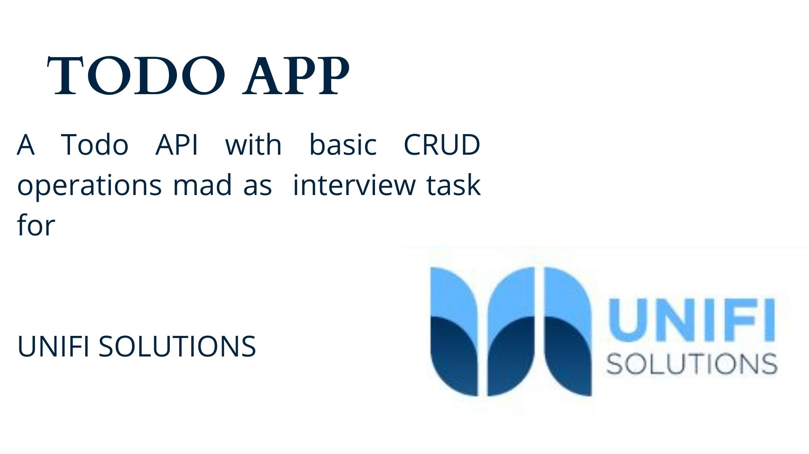

# Tools & Libraries: 
* Expressjs
* MongoDB
* bcryptj: to encrypt user password
* pinno: logger utility

# Endpoints

### 1 - Register a new Account :
- Send a `POST` request to `/auth/register`
- Request Body in `JSON` is
- *NOTE* all Variables are of type `String`
- *NOTE* use the same `keys` specified in the json below
```json
{
    "username": "zein",             
    "email": "zein@gmail.com",       
    "password": "12345678",
    "confirmPassword": "12345678"
}
```
- response body will be :
```json
{
    "err": false,      // if there is no error
    "message": "The error description if there is any",
    "user": {
        // A user object that contains his info
    },
    "token": "jwt token"
}
```


### 2 - Login a new Account :
- Send a `POST` request to `/auth/login`
```json
{
    "email": "zein@gmail.com",       
    "password": "12345678",
}
```

- Also response body will be :
```json
{
    "err": false,      // if there is no error
    "message": "The error description if there is any",
    "user": {
        // A user object that contains his info
    },
    "token": "jwt token"
}
```


### 3 - Add a new todo

- Send a `POST` request to `/todo/new-todo`
```json
{
    "title": "Todo title",       
    "notes": [
        "Note one",
        "Note two"
        // at least one note is required
    ],
    "attachement": // optional file 
}
```


### 4 - Update todo
- Send a `POST` request to `/todo/update-todo`
```json
{
    "title": "Todo title",       
    "notes": [
        "Note one",
        "Note two"
        // at least one note is required
    ],
}
```

### 5 - Get todo by id
- Send a `POST` request to `/todo/get-todo/:todoId`
- Returns the todo with the corresbonding id or an error


### 6 - DELETE todo by id
- Send a `DELETE` request to `/todo/delete-todo/:todoId`
